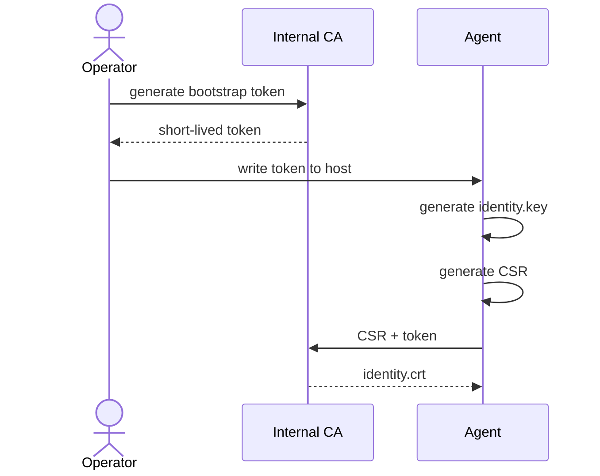
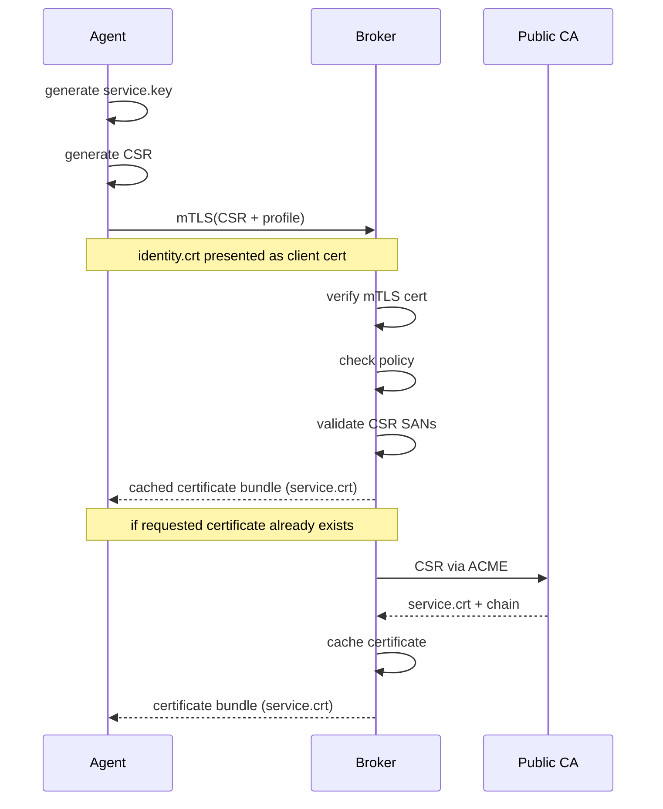

# Certplane

A lightweight control plane for certificate issuance for non-k8s
infrastructures, built around machine identity, declarative policy, and
host-local key generation.

## Agent enroll

## Agent run

